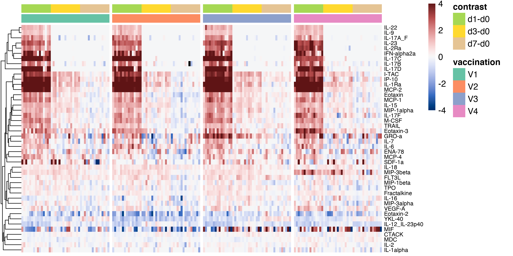

<style type="text/css">

body{ /* Normal  */
      font-size: 12px;
  }
td {  /* Table  */
  font-size: 8px;
}
h1.title {
  font-size: 38px;
  color: DarkRed;
}
h1 { /* Header 1 */
  font-size: 28px;
  color: DarkBlue;
}
h2 { /* Header 2 */
    font-size: 22px;
  color: DarkBlue;
}
h3 { /* Header 3 */
  font-size: 18px;
  font-family: "Times New Roman", Times, serif;
  color: DarkBlue;
}
code.r{ /* Code block */
    font-size: 12px;
}
pre { /* Code block - determines code spacing between lines */
    font-size: 14px;
}
</style>

```{r setup, include=FALSE}
knitr::opts_chunk$set(echo = TRUE, message = FALSE, warning = FALSE)

```

# Heatmmap Function

```{r heatmap_function}

    doheatmap <- function(dat, clus, clus2, ht, rn, cn, col, gaps_col, gaps_row) {
        require(pheatmap)
        require(dendsort)

        tmean.scale=dat

        col_filter <- apply(as.data.frame(tmean.scale), 2, function(z) all(is.na(z)))
        row_filter <- apply(as.data.frame(tmean.scale), 1, function(z) length(z[is.na(z)]) > 10)
        tmean.scale <- tmean.scale[!row_filter, !col_filter]

        col.pal <- diverging_hcl(n=100, palette=col)

        minx = floor(min(tmean.scale))
        maxx = ceiling(max(tmean.scale))

        breaks = seq(-4, 4, length=100)
        legbreaks = seq(-4, 4, length=5)
        
        breaks = sapply(breaks, signif, 4)
        legbreaks = sapply(legbreaks, signif, 4)

        #Run cluster method using
        hcrow = hclust(dist(tmean.scale,  method = "canberra"), method="complete")
        
        if (FALSE) {
            sort_hclust <- function(...) as.hclust(rev(dendsort(as.dendrogram(...))))
        } else {
            sort_hclust <- function(...) as.hclust(dendsort(as.dendrogram(...)))
        }
        if (clus) {
            colclus <- sort_hclust(hc)
        } else {
            colclus = FALSE
        }
        if (TRUE) {
            rowclus <- sort_hclust(hcrow)
        } else {
            rowclus = FALSE
        }
        
        gaps_col <- as.numeric(unlist(str_split(gaps_col,",")))
        gaps_row <- as.numeric(unlist(str_split(gaps_row,",")))

        gaps_col[is.na(gaps_col)] <- 0
        gaps_row[is.na(gaps_row)] <- 0

        hm.parameters <- list(
            tmean.scale, 
            color=col.pal,
            legend_breaks=legbreaks,
            cellwidth=NA, 
            cellheight=NA, 
            scale="none",
            treeheight_col=25,
            treeheight_row=25,
            kmeans_k=NA,
            breaks=breaks,
            # height=80,
            fontsize=12,
            fontsize_row=8,
            fontsize_col=8,
            show_rownames=rn, 
            show_colnames=cn,
            cluster_rows=rowclus, 
            cluster_cols=colclus,
            cutree_rows=1,
            annotation_col = annotation_col,
            annotation_colors = annot_col,
            labels_col = labels_col,
            gaps_col = gaps_col,
            gaps_row = gaps_row,
            annotation_names_col = FALSE,
            na_col = "#000000",
            filename = "plots/figure_5d_heatmmap.pdf"
        )
        
        p <- do.call("pheatmap", c(hm.parameters))
        
        return(p)
    }
```

# Draw Heatmap

```{r draw_heatmap}

  suppressMessages(library("colorspace"))
  suppressMessages(library("dendsort"))
  suppressMessages(library("pheatmap"))
  suppressMessages(library("tidyverse"))
  suppressMessages(library("RColorBrewer"))
  suppressMessages(library("dplyr"))
  suppressMessages(library("grid"))

  
  df.orig <- read.csv("output/f60_diff_counts.csv", check.names = FALSE)
  annot <- read.csv("output/f60_diff_metadata.csv")

  df.mat = df.orig[ , (colnames(df.orig) != "Gene" )] %>% as.data.frame
  row.names(df.mat) <- df.orig$Gene
  df.mat <- as.data.frame(df.mat)
  
  annot$contrast <- factor(annot$contrast)
  groups = c("vaccination","contrast")
  

  annot %>% dplyr::arrange_(.dots=groups) -> annot
  df.mat <- df.mat[,match(annot$sample_id,colnames(df.mat))] 

  annot %>% dplyr::select(groups) -> annotation_col 
  annotation_col = as.data.frame(unclass(annotation_col))
  annotation_col[] <- lapply(annotation_col,factor)
  rownames(annotation_col) <- annot$sample_id
  annot_col = list()
  
  colors <- c("#66C2A5","#FC8D62","#8DA0CB","#E78AC3","#A6D854","#FFD92F","#E5C494")
  
  b=1
  i=1
  while (i <= length(groups)){
    nam <- groups[i]
    grp <- as.factor(annotation_col[,i])
    c <- b+length(levels(grp))-1
    col = colors[b:c]
    names(col) <- levels(grp)
    assign(nam,col)
    annot_col = append(annot_col,mget(nam))
    b = b+c
    i=i+1
  }
  
  labels_col <- colnames(df.mat)
  
  imageWidth = 3000
  imageHeight = 1500
  dpi = 300
  
  
  p <- doheatmap(dat=df.mat, clus=FALSE, clus2=TRUE, ht=50, rn=TRUE, cn=FALSE, col="Blue-Red 3", gaps_col = "45,90,135", gaps_row = "")

  png(
    filename="plots/figure_5d_heatmap.png",
    width=imageWidth,
    height=imageHeight,
    units="px",
    pointsize=4,
    bg="white",
    res=dpi,
    type="cairo")
  
  grid.newpage()
  grid.draw(p[["gtable"]])
  null_var <- dev.off()
  
  
```