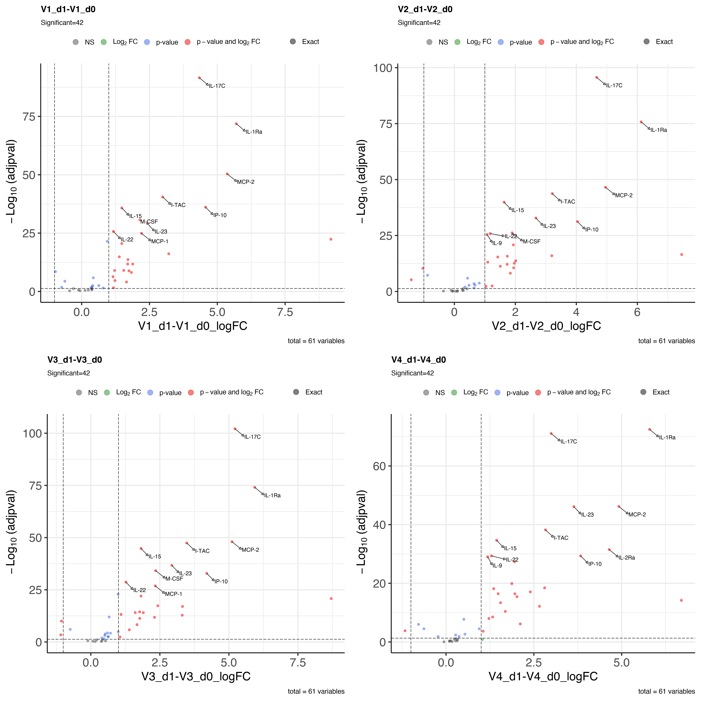

<style type="text/css">

body{ /* Normal  */
      font-size: 12px;
  }
td {  /* Table  */
  font-size: 8px;
}
h1.title {
  font-size: 38px;
  color: DarkRed;
}
h1 { /* Header 1 */
  font-size: 28px;
  color: DarkBlue;
}
h2 { /* Header 2 */
    font-size: 22px;
  color: DarkBlue;
}
h3 { /* Header 3 */
  font-size: 18px;
  font-family: "Times New Roman", Times, serif;
  color: DarkBlue;
}
code.r{ /* Code block */
    font-size: 12px;
}
pre { /* Code block - determines code spacing between lines */
    font-size: 14px;
}
</style>

```{r setup, include=FALSE}
knitr::opts_chunk$set(echo = TRUE, message = FALSE, warning = FALSE)

```

# DEG analysis

```{r deg_analysis}

    suppressMessages(library(limma))
    suppressMessages(library(tidyverse))
    suppressMessages(library(edgeR))
    suppressMessages(library(stringr))
    
    df <- read.csv("output/f60_formatted_data.csv")
    
    annot <- read.csv("input/f60_metadata.csv")
    annot$combined <- paste(annot$vaccination,annot$timepoint, sep="_")
    
    df.m <- df[,-1]
    
    targetfile <- annot[match(colnames(df.m),annot$sample_id),]
    targetfile <- targetfile[rowSums(is.na(targetfile)) != ncol(targetfile), ]
    df.m <- df.m[,match(targetfile$sample_id,colnames(df.m))]
    

    #x <- 2^df.m

    ordered_covariates=c("combined","animal_id")
    
    ordered_covariates=ordered_covariates[order(ordered_covariates!="combined")]

    targetfile <- targetfile %>% select(sample_id,one_of(ordered_covariates)) %>% as.data.frame()

    row.names(targetfile) <- targetfile$sample_id
    dm.formula <- as.formula(paste("~0 +", paste(ordered_covariates, sep="+", collapse="+")))
    design=model.matrix(dm.formula, targetfile)

    colnames(design) <- str_replace_all(colnames(design), "combined", "")

    v <- new("EList", list(E = df.m, design = design))
    
    rownames(v$E) <- df[["Gene"]]
    as.data.frame(v$E) %>% rownames_to_column("Gene") -> df.voom
    fit <- lmFit(v, design)
    
    contrasts_of_interest <- c( "V1_d1-V1_d0",
                                "V2_d1-V2_d0",
                                "V3_d1-V3_d0",
                                "V4_d1-V4_d0")

    cm <- makeContrasts(contrasts = contrasts_of_interest, levels=design)
    
    fit2 <- contrasts.fit(fit, cm)
    fit2 <- eBayes(fit2)


    logFC = fit2$coefficients
    colnames(logFC)=paste(colnames(logFC),"logFC",sep="_")
    
    tstat = fit2$t
    colnames(tstat)=paste(colnames(tstat),"tstat",sep="_")
    
    FC = 2^fit2$coefficients
    FC = ifelse(FC<1,-1/FC,FC)
    colnames(FC)=paste(colnames(FC),"FC",sep="_")
    
    pvalall=fit2$p.value
    colnames(pvalall)=paste(colnames(pvalall),"pval",sep="_")
    
    pvaladjall=apply(pvalall,2,function(x) p.adjust(x,"BH"))
    colnames(pvaladjall)=paste(colnames(fit2$coefficients),"adjpval",sep="_")
    
    finalres=as.data.frame(cbind(v$E,FC, logFC, tstat, pvalall, pvaladjall))
    finalres %>% rownames_to_column("Gene") -> finalres

    colnames(finalres)<-gsub("\\(|\\)","",colnames(finalres))

    write.table(finalres,file="output/f60_deg_results.csv", sep = ",", row.names = FALSE, quote = FALSE)
    
```

# Volcano Plots Figures 5 and S6

```{r plot contrasts}

  suppressMessages(library("EnhancedVolcano"))
  suppressMessages(library("gridExtra"))
  
  Plots <- list()

  for(i in seq_along(contrasts_of_interest)){
    
    contrast <- contrasts_of_interest[i]
    lfccol  <- paste0(contrast,"_logFC")
    pvalcol <- paste0(contrast,"_adjpval")
    
    select_columns <- c("Gene",as.name(lfccol),as.name(pvalcol))
    finalres %>% dplyr::arrange(finalres[,pvalcol]) %>% dplyr::select_(.dots = select_columns) -> plt.df
    
    # Set Y-max
    negative_log10_p_values <- -log10(plt.df[,pvalcol])
    ymax <- ceiling(max(negative_log10_p_values[is.finite(negative_log10_p_values)])) + 1

    plt.df[,pvalcol][negative_log10_p_values > ymax] <- 10**(-ymax)
    shapeCustom <- ifelse(negative_log10_p_values > ymax, 17, 19)
    names(shapeCustom)<- rep("Exact",length(shapeCustom))
    names(shapeCustom)[shapeCustom == 17] <- "Adjusted"
    
    xmax = ceiling(max(plt.df[,lfccol])) + 1
    xmin = floor(min(plt.df[,lfccol])) - 1
    
    genes_to_label <- unique(plt.df$Gene[1:10])
    
    plt.df[,"neglogpval"] <- -log10(plt.df[,pvalcol])
    
    filtered_genes =   plt.df$Gene[plt.df[,pvalcol] <= 0.05 & abs(plt.df[,lfccol]) >= 1]

    Plots[[i]] <- EnhancedVolcano(toptable=plt.df,
                                                x=lfccol,
                                                y=pvalcol,
                                                lab=plt.df[,"Gene"],
                                                selectLab = genes_to_label,
                                                title=contrast,
                                                subtitle = paste0("Significant=",length(filtered_genes)),
                                                xlab=lfccol,
                                                ylab=bquote(~-Log[10]~.("(adjpval)")),
                                                xlim=c(xmin,xmax),
                                                ylim=c(0, ymax),
                                                pCutoff=0.05,
                                                FCcutoff=1,
                                                axisLabSize=24,
                                                labSize=4,
                                                pointSize=2,
                                                shapeCustom=shapeCustom,
                                                drawConnectors = TRUE,
                                                labCol = "black")
  }

  nplots=length(Plots)
  nrows=ceiling(nplots/ceiling(sqrt(nplots)))

  imageWidth = 3000*ceiling(nplots/nrows)
  imageHeight = 3000*nrows
  dpi = 300

  png(
    filename="plots/figure_5_and_S6_volcano_plots.png",
    width=imageWidth,
    height=imageHeight,
    units="px",
    pointsize=4,
    bg="white",
    res=dpi,
    type="cairo")

  do.call("grid.arrange", c(Plots, nrow=nrows))
  null_var <- dev.off()

  
  
```

# Session Info

```{r session_info}

sessionInfo()

```